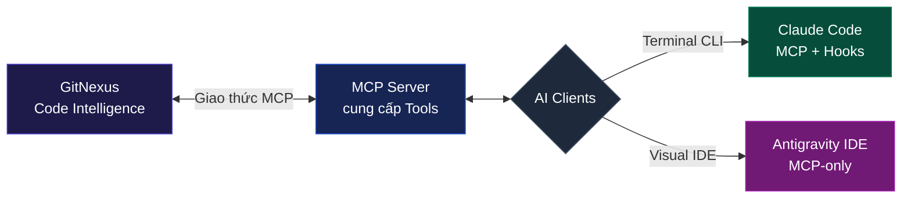
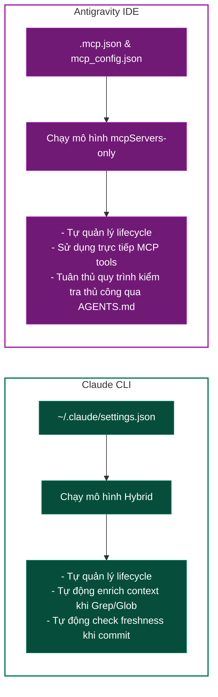
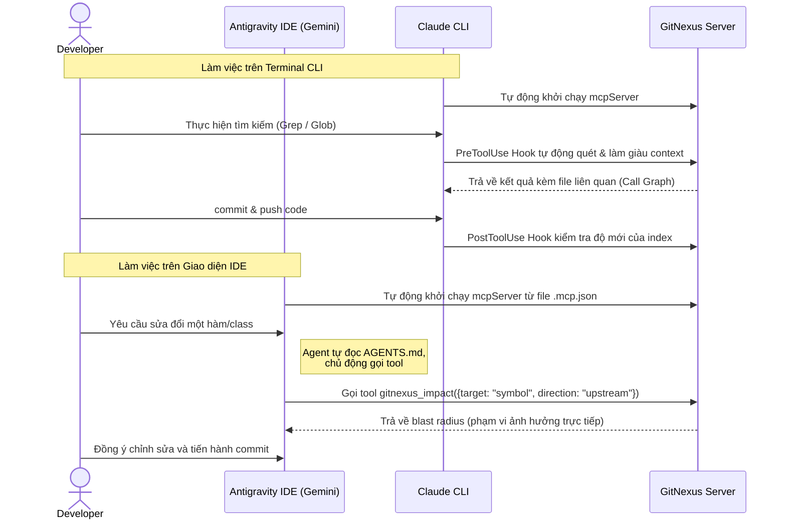

# Hướng dẫn Tích hợp và Tối ưu hóa GitNexus, MCP & Hooks cho Claude CLI và Antigravity IDE

Tài liệu này tổng hợp kiến thức từ các tài liệu cấu hình, so sánh các cấp độ tích hợp và đưa ra chiến lược tối ưu nhất khi phát triển đồng thời trên **Claude CLI (Claude Code)** và **Antigravity IDE (Gemini Client)**.

---

## 1. Khái niệm Cốt lõi (Core Concepts)

Để xây dựng một môi trường phát triển thông minh với AI, chúng ta cần hiểu rõ 3 thành phần công nghệ sau:



*   **GitNexus:** Hệ thống Code Intelligence phân tích toàn bộ cấu trúc dự án (Monorepo/Multi-project). Nó sinh ra AST (Abstract Syntax Tree), xây dựng call graph, phân tích luồng thực thi và tính toán phạm vi ảnh hưởng (blast radius) khi chỉnh sửa code.
*   **Model Context Protocol (MCP):** Giao thức mở giúp kết nối AI Agent với các ứng dụng bên ngoài. GitNexus đóng vai trò là một MCP Server cung cấp các công cụ: `query` (tìm kiếm ngữ nghĩa), `context` (lấy ngữ cảnh symbol), `impact` (phân tích ảnh hưởng), `detect_changes` (phát hiện thay đổi).
*   **Lifecycle Hooks (Chỉ có ở Claude CLI):** Cơ chế cho phép can thiệp vào vòng đời gọi công cụ của Agent. Nó gồm `PreToolUse` (chạy script trước khi gọi công cụ để bổ sung dữ liệu đầu vào) và `PostToolUse` (chạy script sau khi thực hiện công cụ để kiểm tra hoặc cập nhật trạng thái).

---

## 2. Phân bổ các Cấp độ Cấu hình MCP (Gemini/Antigravity)

Hệ sinh thái Gemini và Antigravity IDE hỗ trợ tải cấu hình MCP từ 3 cấp độ khác nhau. Việc phân bổ đúng chỗ giúp hệ thống mượt mà và tránh xung đột dữ liệu:

| Cấp độ cấu hình | Đường dẫn lưu trữ | Phạm vi tác động | Độ ưu tiên | Khuyên dùng cho |
| :--- | :--- | :--- | :--- | :--- |
| **Cấp Dự án (Project)** | `<project-root>/.mcp.json` | Chỉ áp dụng khi mở dự án hiện tại. | **1 (Cao nhất)** | Các công cụ gắn liền với codebase của dự án (ví dụ: [Graphify](file:///Users/vanhungphan/Developement/ai/agentproject-workspaces/.mcp.json#L3-L10), DB Reader nội bộ). |
| **Cấp IDE Client** | `~/.gemini/antigravity-ide/mcp_config.json` | Chỉ áp dụng trong giao diện Antigravity IDE. | **2 (Trung bình)** | Các công cụ đặc thù UI/UX, hỗ trợ debug đồ họa trên IDE (Chrome DevTools, Screen Capturer). |
| **Cấp Hệ thống / Lõi** | `~/.gemini/config/mcp_config.json` | Toàn bộ các công cụ Gemini trên máy (IDE + Terminal CLI). | **3 (Thấp nhất)** | Tri thức cá nhân toàn cục, công cụ hệ thống bảo mật có chứa API key cá nhân (như Obsidian MCP, Google Search API). |

> [!IMPORTANT]
> **Quy tắc phân bổ:** Tuyệt đối không khai báo cấu hình MCP của một dự án cụ thể ở cấp độ Hệ thống (Global) để tránh việc Agent bị lẫn lộn ngữ cảnh/dữ liệu khi bạn chuyển đổi giữa các dự án khác nhau.

---

## 3. Các Phương thức Tích hợp GitNexus trên Claude CLI

Claude CLI hỗ trợ cơ chế Hook mạnh mẽ, dẫn đến 3 cách tiếp cận cấu hình khác nhau:

### A. mcpServers-only (Chỉ cấu hình Server)
Claude tự động quản lý vòng đời của GitNexus MCP server.
*   **Ưu điểm:** Cấu hình cực kỳ đơn giản, tự động bật/tắt (auto lifecycle), không cần quản lý tiến trình chạy ngầm.
*   **Nhược điểm:** Thiếu khả năng tự động tối ưu ngữ cảnh (auto-enrich) khi dùng lệnh Grep/Glob thông thường và không tự động cảnh báo index stale (quá hạn).

### B. Hook-based (Chỉ dùng Hooks)
Không khai báo mcpServers, thay vào đó chạy GitNexus mcp làm tiến trình nền (sidecar) và sử dụng Hooks để can thiệp.
*   **Ưu điểm:** Tự động hóa việc "làm giàu" kết quả tìm kiếm (auto-enrich) và tự kiểm tra index freshness.
*   **Nhược điểm:** Phải tự bật/tắt tiến trình nền `gitnexus mcp` bằng tay, dễ bị rò rỉ hoặc treo tiến trình.

### C. Hybrid (mcpServers + Hooks) — Khuyến nghị
Sự kết hợp hoàn hảo: Khai báo `gitnexus` trong danh sách `mcpServers` để Claude tự quản lý vòng đời, đồng thời cấu hình `hooks` để kích hoạt tính năng tự động làm giàu thông tin và kiểm tra index.

---

## 4. Chiến lược Tối ưu hóa khi dùng song song Claude CLI & Antigravity IDE

Khi làm việc đồng thời với cả hai công cụ, chúng ta gặp phải một giới hạn: **Antigravity IDE chỉ hiểu cấu hình `mcpServers` chuẩn, hoàn toàn không hỗ trợ cơ chế `hooks` của Claude.**

Để giải quyết vấn đề này, chiến lược tối ưu nhất là cấu hình **bất đối xứng**:



### Tại sao đây là giải pháp tối ưu?
1.  **Tránh xung đột:** IDE bỏ qua phần `hooks` không được hỗ trợ và chỉ load `mcpServers` bình thường.
2.  **Tự động hóa tối đa trên CLI:** Khi làm việc với Terminal CLI, bạn không cần nhớ chạy các lệnh phân tích thủ công; cơ chế Hook sẽ tự động "nhắc nhở" và cập nhật dữ liệu.
3.  **An toàn tuyệt đối trên IDE:** Agent trên IDE sẽ trực tiếp nhìn thấy các tool `impact` và `detect_changes` trong danh sách MCP Tools và chủ động gọi chúng theo quy chuẩn viết trong file [AGENTS.md](file:///Users/vanhungphan/Developement/ai/agentproject-workspaces/AGENTS.md).

### Vai trò Cầu nối của GitNexus Global
Để cấu hình bất đối xứng này vận hành trơn tru nhất, điểm mấu chốt là **cả Claude CLI và Antigravity IDE đều phải gọi chung bản cài đặt GitNexus Global** (thay vì chạy thông qua `npx` hoặc các phiên bản cục bộ khác nhau). 

Lợi ích của sự nhất quán này bao gồm:
*   **Dùng chung Cơ sở dữ liệu Index:** Cả hai môi trường đều đọc và ghi vào cùng một thư mục dữ liệu phân tích cấu trúc `.gitnexus/` tại root của dự án. Dữ liệu index được tạo ra bởi CLI (ví dụ qua hook sau khi commit) sẽ ngay lập tức được phản ánh và sẵn sàng cho IDE sử dụng mà không cần quét lại.
*   **Tránh xung đột Phiên bản (Version Mismatch):** Nếu Claude CLI dùng một version GitNexus khác (ví dụ qua `npx`) so với IDE, định dạng output của các tool MCP có thể bị lệch cấu trúc. Việc ép cả hai client gọi chung file nhị phân global `/opt/homebrew/bin/gitnexus` đảm bảo hành vi của agent đồng nhất 100%.
*   **Khởi động Tức thì (Zero Startup Latency):** Việc gọi file nhị phân đã cài sẵn trên máy giúp tăng tốc độ load MCP Server khi mở phiên làm việc mới trên cả IDE lẫn CLI, loại bỏ hoàn toàn độ trễ kiểm tra hoặc download từ npm registry của `npx`.
*   **Giải quyết triệt để lỗi môi trường:** Claude CLI khi chạy đôi khi không thừa kế đầy đủ biến môi trường `$PATH` từ shell profile, dẫn đến việc gọi lệnh `gitnexus` trực tiếp bị lỗi. Việc cấu hình cứng đường dẫn tuyệt đối đến file cài đặt global (`/opt/homebrew/bin/gitnexus`) giúp giải quyết hoàn toàn vấn đề này cho cả hai bên.

---

## 5. Hướng dẫn Cấu hình Chi tiết (MacOS)

### Bước 1: Cài đặt GitNexus Global
Đảm bảo GitNexus đã được cài đặt trên máy của bạn (sử dụng Homebrew hoặc npm global) để tăng tốc độ chạy thay vì sử dụng `npx` tải lại mỗi lần:
```bash
# Cài đặt qua Homebrew (Khuyến nghị trên macOS)
brew install gitnexus

# Hoặc cài đặt qua npm
npm install -g gitnexus

# Xác minh đường dẫn hoạt động
which gitnexus
# Kết quả mong đợi: /opt/homebrew/bin/gitnexus hoặc /usr/local/bin/gitnexus
```

### Bước 2: Thiết lập Hooks cho Claude CLI
Tạo và sao chép các file hook script vào thư mục cấu hình cá nhân của bạn:
```bash
# Tạo thư mục chứa hooks
mkdir -p ~/.claude/hooks/gitnexus/

# Sao chép hook script từ repo dự án vào thư mục cấu hình global của Claude
cp -r hooks/gitnexus/ ~/.claude/hooks/gitnexus/
```

### Bước 3: Cấu hình File settings.json cho Claude CLI
Chỉnh sửa file [settings.json](file:///Users/vanhungphan/.claude/settings.json) toàn cục của Claude Code để chạy chế độ **Hybrid**:

```json
{
  "model": "dev",
  "mcpServers": {
    "gitnexus": {
      "command": "/opt/homebrew/bin/gitnexus",
      "args": ["mcp"]
    }
  },
  "hooks": {
    "PreToolUse": [
      {
        "matcher": "Grep|Glob|Bash",
        "hooks": [
          {
            "type": "command",
            "command": "node '/Users/vanhungphan/.claude/hooks/gitnexus/gitnexus-hook.cjs'",
            "timeout": 10,
            "statusMessage": "Enriching with GitNexus graph context..."
          }
        ]
      }
    ],
    "PostToolUse": [
      {
        "matcher": "Bash",
        "hooks": [
          {
            "type": "command",
            "command": "node '/Users/vanhungphan/.claude/hooks/gitnexus/gitnexus-hook.cjs'",
            "timeout": 10,
            "statusMessage": "Checking GitNexus index freshness..."
          }
        ]
      }
    ]
  },
  "tui": "fullscreen",
  "theme": "auto"
}
```

### Bước 4: Cấu hình File cho Antigravity IDE
Đối với IDE, cấu hình MCP Server cấp dự án tại [.mcp.json](file:///Users/vanhungphan/Developement/ai/agentproject-workspaces/.mcp.json) sẽ ghi đè và thiết lập trực tiếp:

```json
{
  "mcpServers": {
    "graphify": {
      "command": "python3",
      "args": [
        "-m",
        "graphify.serve",
        "./graphify-out/graph.json"
      ]
    },
    "gitnexus": {
      "command": "/opt/homebrew/bin/gitnexus",
      "args": ["mcp"]
    }
  }
}
```

---

## 6. Quy trình làm việc tiêu chuẩn của Nhà phát triển (Developer Workflow)

Khi đã cấu hình cấu trúc bất đối xứng trên, quy trình làm việc hằng ngày của bạn sẽ diễn ra như sau:



### Quy tắc an toàn bắt buộc khi dev trên IDE:
1.  **Trước khi sửa đổi:** Luôn yêu cầu Agent chạy công cụ `impact` hoặc `context` trên đối tượng chuẩn bị chỉnh sửa.
2.  **Trước khi commit:** Yêu cầu Agent chạy `detect_changes` để so sánh scope thay đổi thực tế với thiết kế ban đầu.
3.  **Sau khi thay đổi lớn:** Nếu có sự thay đổi lớn về cấu trúc file/thư mục, chạy lệnh `node .gitnexus/run.cjs analyze` hoặc `npx gitnexus analyze` từ Terminal để làm tươi (refresh) dữ liệu đồ thị.
